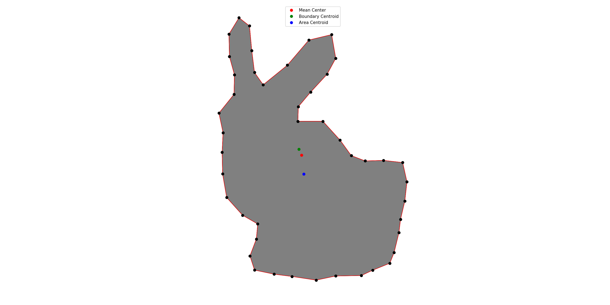
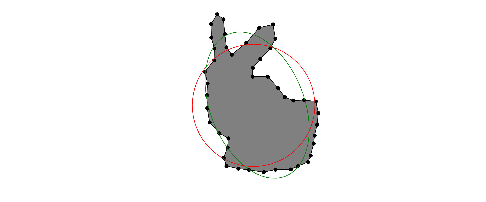

# ShapeAnalyzer
ShapeAnalyzer-Shape Analysis and Description Methods

## Requirements
* [shapely](https://github.com/Toblerity/Shapely)
* [pyvoronoi](https://github.com/Voxel8/pyvoronoi)

## ShapeAnalyzer Illustrations
[ShapeAnalyzer-Shape Analysis and Description Methods.ipynb](https://github.com/geoinsights/ShapeAnalyzer/blob/master/ShapeAnalyzer-Shape%20Analysis%20and%20Description%20Methods.ipynb)
* Shape Representations
 

* Mean Center，Boundary Centroid，Area Centroid

* Minimum Bounding Geometry

* Maximum Inscribed Circle

* Fitting Circle and Ellipse

* Shape Eign Value and Vector, Confidence Ellipses

